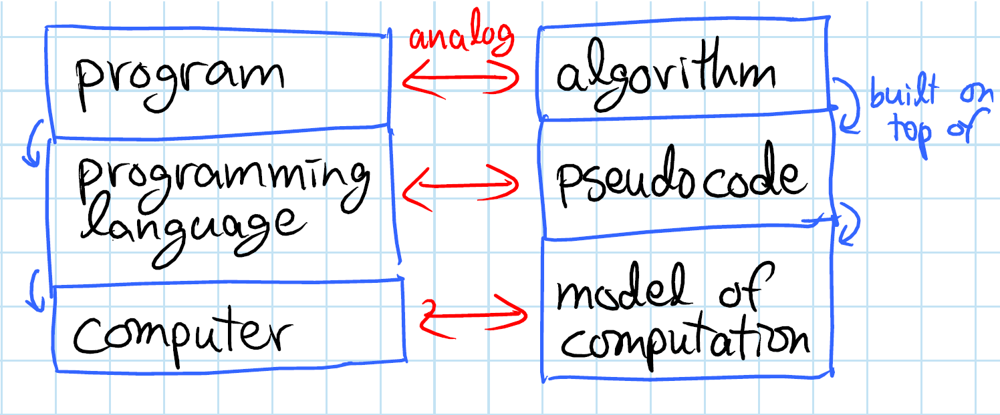
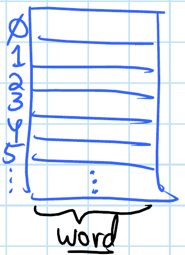
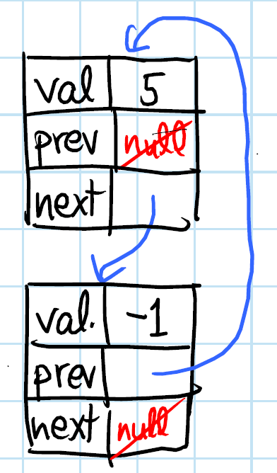

# Models of computation

## Specification

* Allowed operations for algorithms
* complexity (time, space, etc.) of each operation

>  the sum of cost of all operations of a algorithm equals the cost of that algorithm

## Various models of computation

### RAM Machine

<u>**R**</u>andom <u>**A**</u>ccess <u>**M**</u>achine

- random access memory (a very big array)
- O(1) registers (size of eachL 1 **word**)
  - what is a word? basic object (not talking about very big numbers for example)
- can do the following in O(1) time:
  - load word **@i** into register **r[j]**
  - compute (**+**, **-**, **\***, **/**, **&**, **|**, **^**) in O(1) on registers
  - store regirster **r[i]** into memory location **@i**

#### Characteristics
* realistic
* powerful
* good for implementing abstractions

### Pointer Machine

- dynamically allocated objects (named tuples)
- objects have constant O(1) fields
- each field is a word or _pointer_ to another object (AKA reference) or `None`
- Weaker than RAM => can be implemented in a RAM

### Python Model

- lets you choose either of the models

#### Two very important types of implementations on Python

* RAM-like: `list[i] = list[j] + 5`     | O(1)
* PM-like:  `x = x.next`                | O(1)

## Document Distance problem

